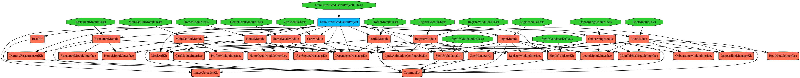
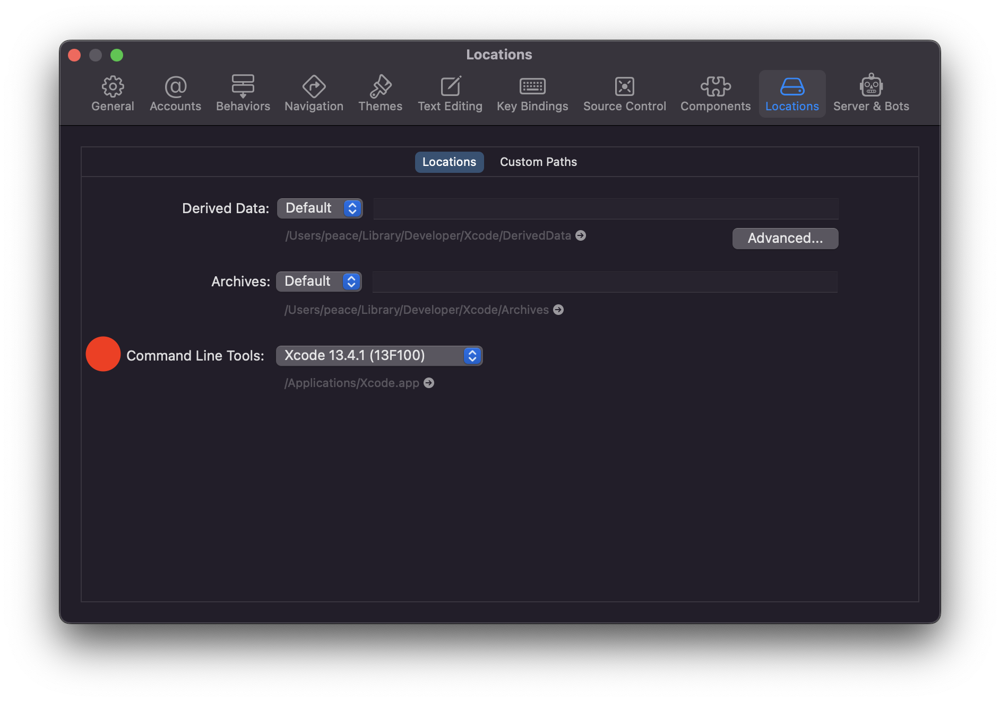

<h1 
align="center">
<br>
  
<br>
<br>
TechCareerGraduationProject-VIPER </h1>

<h6 align="left"> 
<br>
Techcareer is a brand under the one of the biggest hiring company that is called kariyer.net in Turkey which is focused on technology and bootcamps.

</h6>

<h6 align="left"> During the Development, most of the time VIPER rules are considered for the clean code purposes.
</h6>
<br>

# 07.07.2022 - Updates
[](https://tuist.io) 

## Personal Objectives
- Learning and writing Unit and UI Tests
- Refactoring the code to solve repetition, violations redundancy and increasing build time
- Making whole app as Modular to see the problems in scalable app.


## Outline 
- Project is refactored by the subjects such Access Modifiers, Protocol/Extension for repeated feature, removing direct dependency in VIPER Modules as much as possible.

- After refactoring, the project was ready to implement unit tests and ui tests.
Since every view must have its presenters to be tested, some business logic has been shifted to CollectionViewCells

- Validators have been added for both Unit and UI Tests. The logic is simple to only focusing on getting know-how about UI and Unit tests.

- Keyboard logic has been added. This can be used as base class by inheritance

- 143 Unit tests and 5 UI Tests have been added. All Modules have been covered.

- For clean code, swiftlint added with custom rules.

- Bundle Matching is done by Tuist, However, custom classes and helper classes have been refactored which caused a lot of errors to handle.

- Generic instantiation/dequeing and registering methods have been implementeed.
- ViewModel Logics have been shifted to Cells. DTO is wrapped in Main Module Preesenters.
- Fastlane has been added without any CI or Actions. UI Tests video via Fastlane added. Coverage for every Module is planning to be added with [Slather](https://github.com/SlatherOrg/slather) or any other platform.

- After the big refactor, the app is converted into as Modular App by the [Tuist](https://tuist.io). Big thanks to the Tuist Contributors and the team
Problems about the concrete type of Routers which depends on each other and the Circular Dependency problem is solved and explained in the Tuist part.

## Tuist

Tuist is a command line tool that helps you generate, maintain and interact with Xcode projects.

<h6 align="left"> Modular Approach
</h6>

I am highly influenced by the [Video](https://www.youtube.com/watch?v=UKs5HYlTXOM) Session of the NSIstanbul.

- Routers were depending on and knowing other concrete type of Routers. For example, Root Module -> Login Module -> MainTabBarModule -> Profile -> Login Module.
- Since Profile Module depends of Login and Login Depends on Profile Module.
This creates Circular Dependency and Modular Approach does not work.
- To prevent such a case like this, each Module has their creation of module interface target. However, this does not solve the problem when it comes to injection of the modules.
- This Dependency Injection has done in App Level with DependencyEngineKit. Each module or Kits have injection in App level to use it on Modules.
By this, Modules only know the Interfaces of the other modules.
- For detailed info, check the video link above..

<h6 align="left"> Target Dependencies
</h6>

- For know-how purposes, project is almost using any type of Dependency type such as XCFrameworks, SPM Modules, SDK(e.g. XCTest), target as a dependency...
- To create XCFrameworks, I have used xcbuild archive and -create framework of Moya and GMStepper(made as a project). If the used dependency is legacy, XCFramework seems the best approach.
- Moya was depending on too many dependencies such as RxSwift, ReactiveKit and so on, to prevent this, I have created XCFrameworks that depend on Alamofire(it has problems for more info look at the TODO section)
- Cocoapods dependencies have deleted and some of them shifted to as SPM.
- BaseKit(Experimental) is using XCTest which is located in Developer Section. This is why XCode has to specify Command Line Tools which is explained in Getting Starteed.

<h6 align="left"> Dependency Graph without External Dependencies
</h6>

<p align="center">
    
</p>

<h6 align="left"> Configs, Scripts, Options, Settings
</h6>

- All of these project specific specs have been added in main Project file.

## Getting Started
- First of all, You have to specify Commmand Line Tools in XCode. Click on XCode -> Preferences -> Move into Locations -> Set Command Line Tools. By this, you can reach developer directory to access XCTest SDK.

<p align="center">
  
</p>

```bash
tuist fetch # In project directory, call this command to install SPM Packages.
tuist edit # To edit Manifest files call this command(if you need it)
tuist generate # This command generates XCode Project & XCode Workspace
```

- If you would like to generate only specific Project, specify the name after generate command

- -Workspace scheme consists every unit tests to be tested. Alternatively, fastlane can be used(do not forget to change build and clean settings) by ``` fastlane custom_lane``` command

- If you would like to change the code to test some of the features you can cache the targets via ``` tuist cache warm ``` command
- Optionally, you can download [swiftlint](https://github.com/realm/SwiftLint) which tuist will add and run the script.

## TODOs and Violations

- Validation logic can be combined as one module(kit) to be used. Also, one common protocol can use for the general type. Structure can be revisited in terms of [liskov substitution principle](https://en.wikipedia.org/wiki/Liskov_substitution_principle) and [interface  segregation principle](https://en.wikipedia.org/wiki/Interface_segregation_principle)
- At first, I only included specific XCFrameworks of Firebase with its interactions. However, CoreInternal has some problems to work properly. I have shifted to SPM as a dependency. All the Unit and UI Test targets have common error as 'Firebase not found'. This problem could not solve by giving header and module.map files as I have done with Pods. 
- To solve second problem, every module depends on Firebase Core.. That can be revisited even cache is possible..
- Moya needs Alamofire as a Dependency, even XCFramework has Alamofire as a dependency, Moya could not find Alamofire, for workaround and being lazy, I have added Alamofire in every Moya dependent module. It needs to be one dependency which depends on Alamofire.
- UI Tests only used to understand which ways it can be used and simplified. Launch arguments must be added to moving on specific Screen. Test is only working on Login Module currently..
- Fastlane can be improved by the Slather which is specified in Gemfile.

## Fastlane UITest Video

https://user-images.githubusercontent.com/96867747/177652055-8802cbf2-39e1-4395-ab58-7aa4b07c81c0.mp4

## Screenshots
<p float="left">
  
  
   
   
c

## Project Requirements

- Given all API endpoints by the instructor must be used in the project
- Users must add products to the cart
- Users must delete a single item

## Architecture
VIPER. I have used ViewModels in Presenter Layer and Router handles all of the navigation(Views have no navigation-related code). This is why some of the Router layers interact with the Presenter.

## Tech stack & Open-source libraries 
- Onboarding, log in and Authenticated User scenarios are considered and each scenario is handled by the RootModule to show the first Module/View
- iOS 13+ available [UICollectionViewCompositionalLayout](https://developer.apple.com/documentation/uikit/uicollectionviewcompositionallayout)  (The whole project is done by compositional layout since there is no need for nested collection views and it has advantages over Flow layout)
- iOS 14+ available new [PageControlAPI](https://developer.apple.com/documentation/uikit/uipagecontrol/3577679-preferredindicatorimage) (preferredIndicatorImage and continous interaction) is used in Onboarding Screen for better UI performance
- [Moya](https://github.com/Moya/Moya) for Network Abstraction (I have created a dummy API that differs from the instructor's API and abstracting each Target via Moya is powerful and fast. Check the Enterprise folder in the project.. Also, it uses Alamofire as a backbone)
- Restaurant Endpoint is configured by me which you can look at the JSON file in my repo via [link](https://github.com/baris-cakmak/dummy-restaurant-api)
- [Lottie](https://github.com/airbnb/lottie-android) Lottie is a powerful library for animations and every screen has Lottie animation for better UI Performance. Big thanks to Airbnb team
- [FirebaseAuth](https://github.com/firebase/firebase-ios-sdk) to user authenticate, FirebaseAuth is used for log in and Register
- [FirebaseFirestore](https://github.com/firebase/firebase-ios-sdk) to save user information such as profile image URL and so on, FirebaseFirestore is used. RealtimeDatabase could have been used as well.
- [FirebaseStorage](https://github.com/firebase/firebase-ios-sdk) to save the user's profile image on a Cloud to fetch and display on Profile Screen
- [SDWebImage](https://github.com/SDWebImage/SDWebImage) to handle all of the images in a network, SDWebImage is used. Also, iOS 13+ Available large indicator loading is used for better UX performance

https://user-images.githubusercontent.com/96867747/161802138-2b68f4b6-10dd-4a40-9d8e-29f80d227091.mp4

